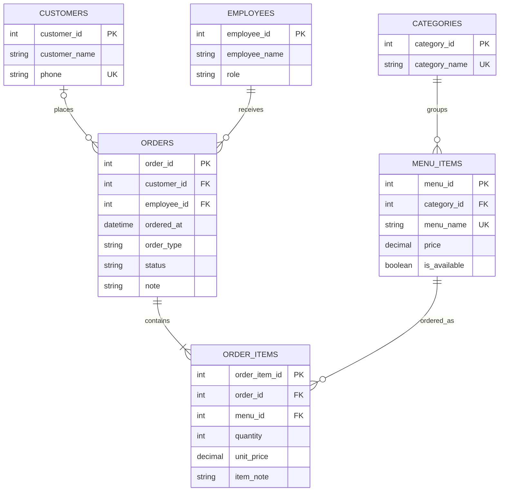

# โปรเจกต์ฐานข้อมูลร้านอาหารตามสั่ง

## 1. Business rules

1. ร้านบันทึกพนักงานและบทบาท พนักงานหนึ่งคนรับออเดอร์ได้หลายใบ แต่ออเดอร์แต่ละใบมีพนักงานผู้รับหนึ่งคน
2. ลูกค้าลงทะเบียนได้ และลูกค้าหนึ่งคนมีหลายออเดอร์ได้ ออเดอร์อาจไม่ระบุลูกค้าเมื่อเป็นลูกค้าทั่วไป
3. หมวดหมู่หนึ่งหมวดมีหลายเมนู เมนูแต่ละรายการอยู่ในหมวดหมู่เดียว
4. ออเดอร์หนึ่งใบต้องมีอาหารอย่างน้อยหนึ่งรายการ และรายการอาหารแต่ละแถวอยู่ในออเดอร์เดียว
5. เมนูหนึ่งอย่างปรากฏในรายการอาหารได้หลายแถว แต่รายการอาหารหนึ่งแถวอ้างถึงเมนูเดียว
6. รายการอาหารต้องมีจำนวนมากกว่า 0 และเก็บราคาต่อหน่วย ณ เวลาขาย เพื่อคงยอดเดิมเมื่อราคาเมนูเปลี่ยน
7. เมนูที่หยุดขายไม่สามารถเพิ่มเข้าออเดอร์ใหม่ได้ ออเดอร์เดิมยังอ่านข้อมูลได้
8. ออเดอร์มีประเภททานที่ร้าน/กลับบ้านและสถานะรับออเดอร์/กำลังทำ/เสร็จแล้ว/ยกเลิก
9. ยอดออเดอร์คำนวณจากผลรวม `quantity × unit_price` ทุกแถว ไม่เก็บยอดซ้ำในตาราง orders

## 2. Entity

`customers`, `employees`, `categories`, `menu_items`, `orders`, `order_items` รวม 6 entity

## 3–4. ความสัมพันธ์และการปรับให้เหมาะสม

| ความสัมพันธ์ | Cardinality | การมีส่วนร่วม | การทำจริง |
|---|---|---|---|
| ลูกค้า → ออเดอร์ | 1:M | ลูกค้า 0..หลาย; ออเดอร์ 0..1 ลูกค้า | `orders.customer_id` เป็น FK และ NULL ได้ |
| พนักงาน → ออเดอร์ | 1:M | พนักงาน 0..หลาย; ออเดอร์ 1 พนักงาน | `orders.employee_id` เป็น FK และ NOT NULL |
| หมวดหมู่ → เมนู | 1:M | หมวดหมู่ 0..หลาย; เมนู 1 หมวด | `menu_items.category_id` เป็น FK และ NOT NULL |
| ออเดอร์ → รายการอาหาร | 1:M | ออเดอร์ 1..หลายตามกฎธุรกิจ; รายการ 1 ออเดอร์ | `order_items.order_id` เป็น FK และ NOT NULL |
| เมนู → รายการอาหาร | 1:M | เมนู 0..หลาย; รายการ 1 เมนู | `order_items.menu_id` เป็น FK และ NOT NULL |

เดิม `orders` กับ `menu_items` มีความสัมพันธ์ M:N จึงแยกตารางกลาง `order_items` เพื่อเก็บจำนวน ราคาขายจริง และหมายเหตุเฉพาะจาน การเพิ่มออเดอร์ผ่านเว็บทำใน transaction เดียวเพื่อรักษากฎ 1..หลาย หากเพิ่มตรงด้วย SQL ให้เพิ่มรายการอาหารก่อน `COMMIT` ด้วยตนเอง

## 5 และ 7. Attributes / Data dictionary

`PK` = Primary Key, `FK` = Foreign Key, `NN` = NOT NULL, `UQ` = UNIQUE; `INTEGER` เป็นจำนวนเต็ม, `TEXT` เป็นข้อความ, `NUMERIC` เป็นจำนวนราคา

| ตาราง | Attribute | ชนิด | ข้อกำหนด / ความหมาย |
|---|---|---|---|
| customers | customer_id | INTEGER | PK, รหัสลูกค้า |
| customers | customer_name | TEXT | NN, ชื่อลูกค้า |
| customers | phone | TEXT | UQ, NULL ได้, เบอร์โทร |
| employees | employee_id | INTEGER | PK, รหัสพนักงาน |
| employees | employee_name | TEXT | NN, ชื่อพนักงาน |
| employees | role | TEXT | NN, เจ้าของร้าน/พ่อครัว/พนักงาน |
| categories | category_id | INTEGER | PK, รหัสหมวด |
| categories | category_name | TEXT | NN, UQ, ชื่อหมวด |
| menu_items | menu_id | INTEGER | PK, รหัสเมนู |
| menu_items | category_id | INTEGER | NN, FK → categories |
| menu_items | menu_name | TEXT | NN, UQ, ชื่อเมนู |
| menu_items | price | NUMERIC | NN, ≥ 0, ราคาปัจจุบัน |
| menu_items | is_available | INTEGER | NN, 0/1, พร้อมขายหรือไม่ |
| orders | order_id | INTEGER | PK, เลขออเดอร์ |
| orders | customer_id | INTEGER | FK → customers, NULL หมายถึงลูกค้าทั่วไป |
| orders | employee_id | INTEGER | NN, FK → employees |
| orders | ordered_at | TEXT | NN, วันเวลา ISO ในเวลาของเครื่องเซิร์ฟเวอร์ |
| orders | order_type | TEXT | NN, ทานที่ร้าน/กลับบ้าน |
| orders | status | TEXT | NN, สถานะออเดอร์ |
| orders | note | TEXT | NULL ได้, หมายเหตุรวม |
| order_items | order_item_id | INTEGER | PK, รหัสรายการ |
| order_items | order_id | INTEGER | NN, FK → orders |
| order_items | menu_id | INTEGER | NN, FK → menu_items |
| order_items | quantity | INTEGER | NN, > 0, จำนวน |
| order_items | unit_price | NUMERIC | NN, ≥ 0, ราคาขายต่อหน่วย ณ วันที่สั่ง |
| order_items | item_note | TEXT | NULL ได้, หมายเหตุรายจาน |

## 6. ER Diagram แบบ Crow's foot



## 8. คำสั่ง SQL

ไฟล์ `schema.sql` สร้างตาราง, PK/FK/CHECK และดัชนี; `seed.sql` เพิ่มข้อมูลตัวอย่าง; ไฟล์ฐานข้อมูล `restaurant.db` เกิดจากการรันเว็บ สามารถเปิดด้วย SQLite Browser หรือ `sqlite3 restaurant.db` ได้ ตัวอย่าง query รวมยอด:

```sql
SELECT o.order_id, o.ordered_at, COALESCE(c.customer_name,'ลูกค้าทั่วไป') AS customer_name,
       SUM(i.quantity * i.unit_price) AS total
FROM orders o
LEFT JOIN customers c ON c.customer_id = o.customer_id
JOIN order_items i ON i.order_id = o.order_id
GROUP BY o.order_id, o.ordered_at, c.customer_name;
```

## 9. เว็บและการเชื่อมฐานข้อมูล

`app.py` เป็นเว็บเซิร์ฟเวอร์และ API; `index.html` เป็นหน้าเว็บ แสดงออเดอร์ ยอดรวม ลูกค้า และเมนู เพิ่มออเดอร์/ลูกค้า/เมนู และแก้ไขข้อมูลลูกค้า/เมนู/สถานะออเดอร์ ฐานข้อมูลทำงานในเครื่องตนเองที่ `127.0.0.1` ไม่เปิดให้เครื่องอื่นเข้าใช้งาน โครงงานตัวอย่างนี้ยังไม่มีระบบบัญชีผู้ใช้และไม่ควรเผยแพร่สู่สาธารณะโดยตรง
